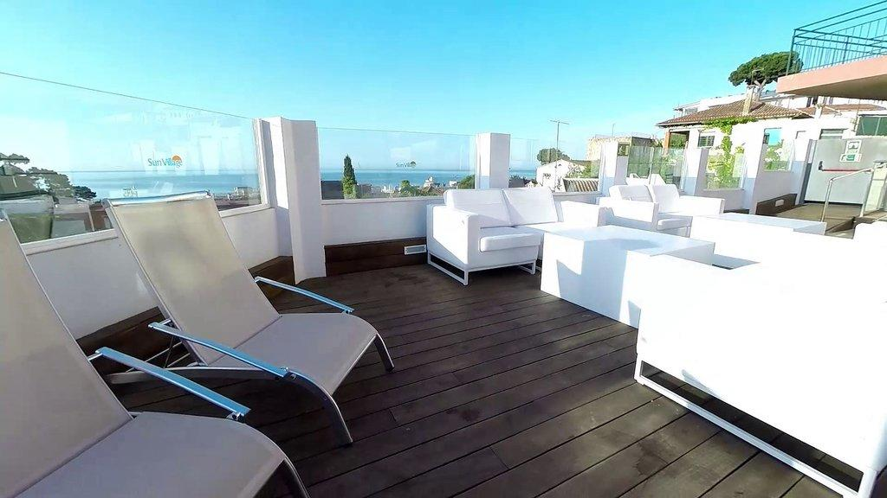
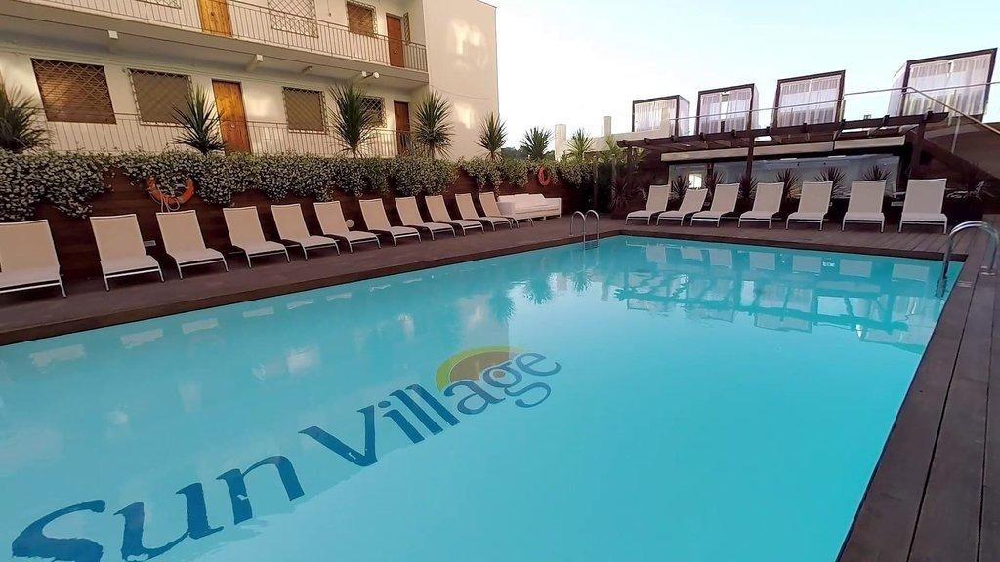
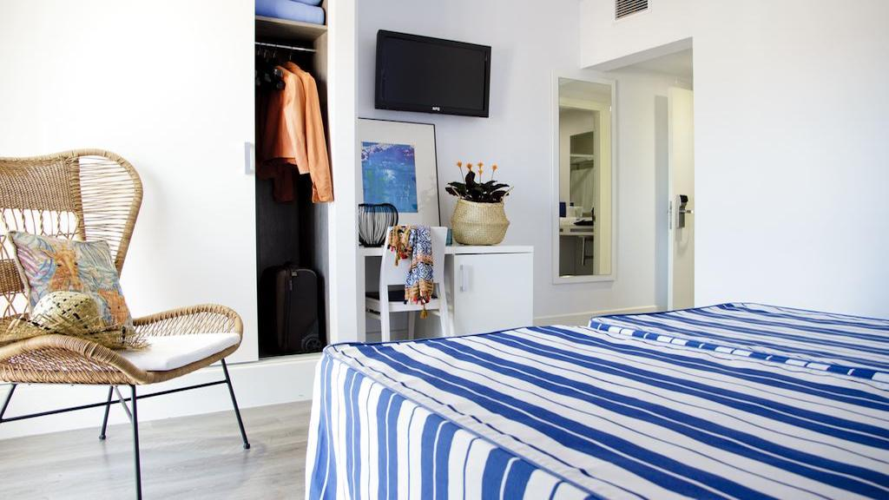

<head>
<link rel="stylesheet" href="https://cdnjs.cloudflare.com/ajax/libs/font-awesome/4.7.0/css/font-awesome.min.css">
</head>

  <h3>Hotel Alegria Sun Village</h3>
  
Located 3 minutes' walk from the beach, **Sun Village** hotel offers rooms with views over the sea, pool or the mountains. The hotel has 2 swimming pools and offers free WiFi.

Air-conditioned rooms are equipped with a flat-screen TV, fridge, furnished balcony and desk. A private bathroom with a shower. A safe is available at an extra cost.

This hotel has a restaurant, a bar and a sun terrace. Reception and info desk are open 24 hours a day.

Several shops and restaurants can be found within 100 m of the property. The centre of Lloret de Mar is less than 5 minutes’ walk from the hotel.

  

    
  

  

  
  

  

  
  

  

  
  

  

  

 

<section class="container">

<i class="fa fa-map-o" style="font-size:20px;color:orange;"></i> 
<b>Location: Lloret</b>

<i class="fa fa-h-square" style="font-size:20px;color:orange;"></i> 
<b>Category: 4 stars</b>

<i class="fa fa-cutlery" style="font-size:20px;color:orange;"></i> 
<b>Restaurants: 1 restaurant and 1 bar</b>

<i class="fa fa-wifi" style="font-size:20px;color:orange;"></i> 
<b>Free Wifi: available in rooms and common areas</b>

<i class="fa fa-coffee" style="font-size:20px;color:orange;"></i> 
<b>Meeting rooms: No</b>

<i class="fa fa-wheelchair" style="font-size:20px;color:orange;"></i> 
<b>Handicapped facilities: Yes</b>

<i class="fa fa-shower" style="font-size:20px;color:orange;"></i> 
<b>Outdoor swimmingpool: 2 pools</b>

<i class="fa fa-users" style="font-size:20px;color:orange;"></i> 
<b>Hotel Nr.of rooms: 160 rooms

<i class="fa fa-clock-o" style="font-size:20px;color:orange;"></i> 
<b>Check in/out: 2pm / check out by 10.00h

</section>

  

