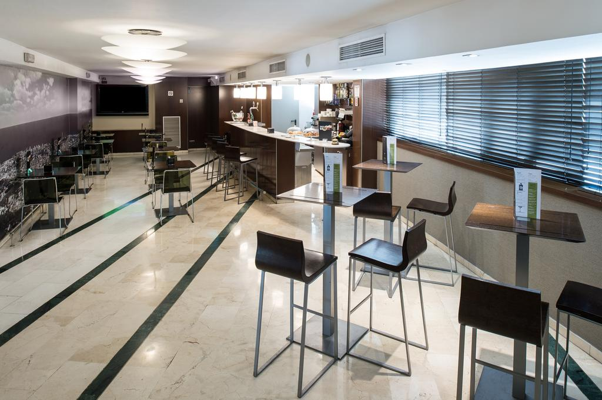
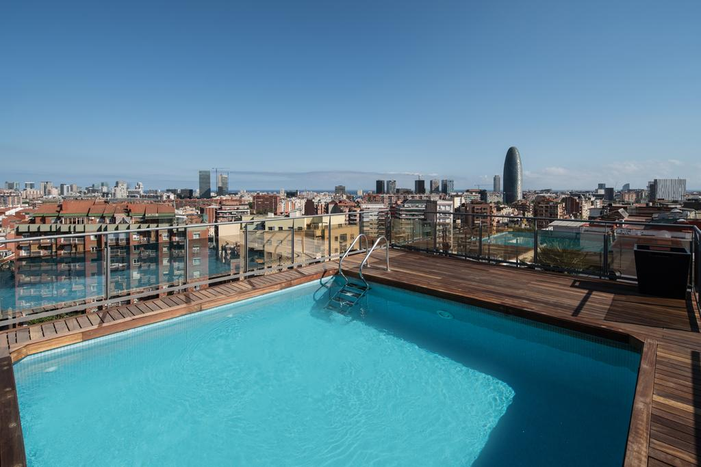
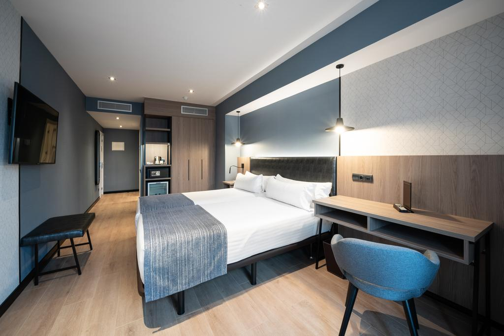

<head>
<link rel="stylesheet" href="https://cdnjs.cloudflare.com/ajax/libs/font-awesome/4.7.0/css/font-awesome.min.css">
</head>

  <h3>Hotel Catalonia Atenas</h3>
  
Set 3 metro stops from central Barcelona, the **Atenas Catalonia** has a **rooftop swimming pool**, offering views of the nearby Torre Agbar and **Sagrada Familia**. It also features free WiFi, a gym and a spa with a Turkish bath.

The bright rooms of **Hotel Atenas Barcelona** have simple décor with wooden flooring. Each has air conditioning, a mini fridge with complimentary water, and satellite TV.

The hotel's buffet breakfast features a **show cooking**. There is a **snack bar** and guests can enjoy stunning city views from the pool, set on the 11th floor.

**The Sagrada Familia is just over one kilometre from the hotel**, while Glòries shopping centre can be reached in 15 minutes by foot.

  

    
  

  

  
  

  

  
  

  

  
  

  

  

 

<section class="container">

<i class="fa fa-map-o" style="font-size:20px;color:orange;"></i> 
<b>Location: Sagrada Familia</b>

<i class="fa fa-h-square" style="font-size:20px;color:orange;"></i> 
<b>Category: 4 stars</b>

<i class="fa fa-cutlery" style="font-size:20px;color:orange;"></i> 
<b>Restaurants: 1 snack bar</b>

<i class="fa fa-wifi" style="font-size:20px;color:orange;"></i> 
<b>Free Wifi: available in rooms and common areas</b>

<i class="fa fa-coffee" style="font-size:20px;color:orange;"></i> 
<b>Meeting rooms: No</b>

<i class="fa fa-wheelchair" style="font-size:20px;color:orange;"></i> 
<b>Handicapped facilities: Yes</b>

<i class="fa fa-shower" style="font-size:20px;color:orange;"></i> 
<b>Outdoor swimmingpool: Yes</b>

<i class="fa fa-users" style="font-size:20px;color:orange;"></i> 
<b>Hotel Nr.of rooms: 215 rooms

<i class="fa fa-clock-o" style="font-size:20px;color:orange;"></i> 
<b>Check in/out: 2pm / check out by 12.00h

</section>

  

