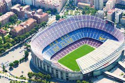

<head>
<link rel="stylesheet" href="https://cdnjs.cloudflare.com/ajax/libs/font-awesome/4.7.0/css/font-awesome.min.css">
</head>

  <h3>Barcelona city tour</h3>
  
From 9.30h to 13.30h They will do a tour that will allow them to learn about the city, not only from the bus, they will stop in Camp Nou Facilities to see the stadium outside and have some explanations about the club and future expansion plan. Then the bus will drive until Diagonal Avenue and stop 10 minutes away from **Sagrada Familia**, the guides will split guests in 2 groups to walk them to see the Temple façades and explain every detail outside. 
Finally, we will drive again direction to **Parc Güell** and visit the public areas and also the most emblematic modernist areas of the parc

  

    
  

  

  
  

  

  
  

  

  
  

  

  

 

<section class="container">

<i class="fa fa-clock-o" style="font-size:20px;color:orange;"></i> 
<b>Duration: 180 mins</b>

<i class="fa fa-user" style="font-size:20px;color:orange;"></i> 
<b>Difficulty Level: Easy</b>

<i class="fa fa-wheelchair" style="font-size:20px;color:orange;"></i> 
<b>Handicapped Facilities: Yes but not recommended</b>

<i class="fa fa-venus-mars" style="font-size:20px;color:orange;"></i> 
<b>Toilet facilities: Yes</b>

<i class="fa fa-bus" style="font-size:20px;color:orange;"></i> 
<b>Requires bus: Yes</b>

<i class="fa fa-users" style="font-size:20px;color:orange;"></i> 
<b>Max. Nr of pax: min 20pax-max 400pax

</section>

  

