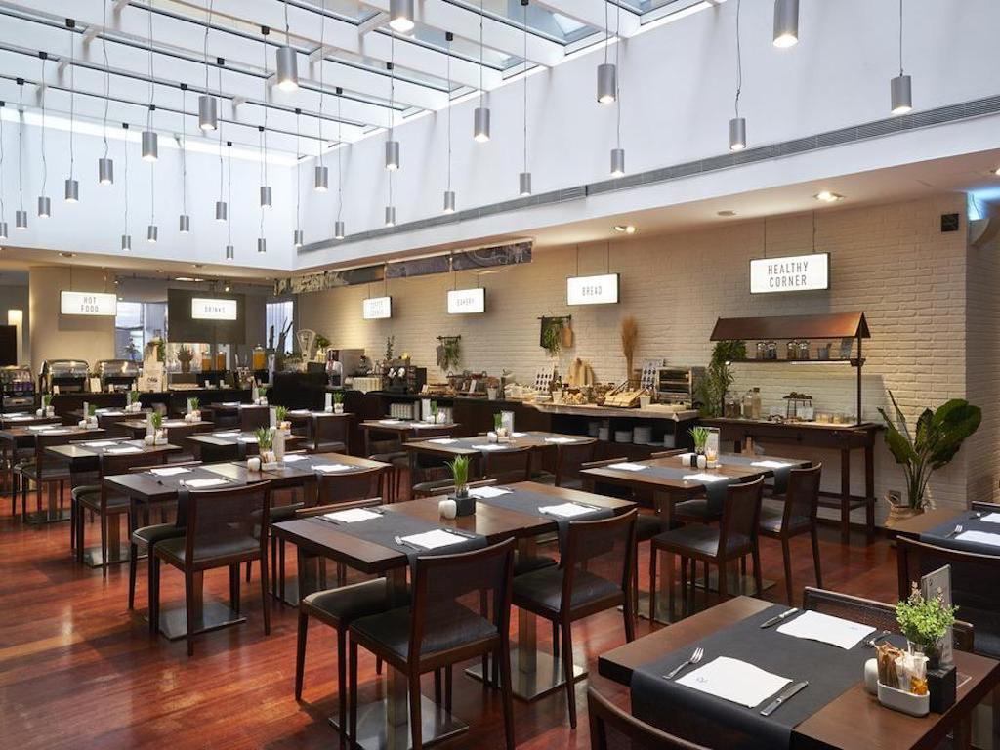
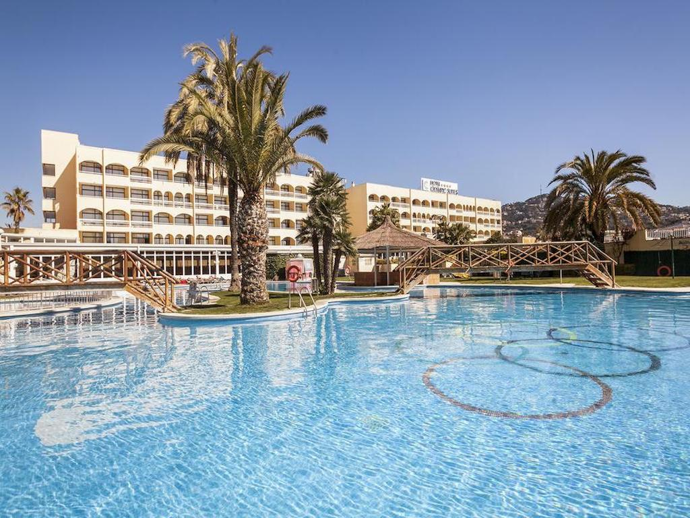
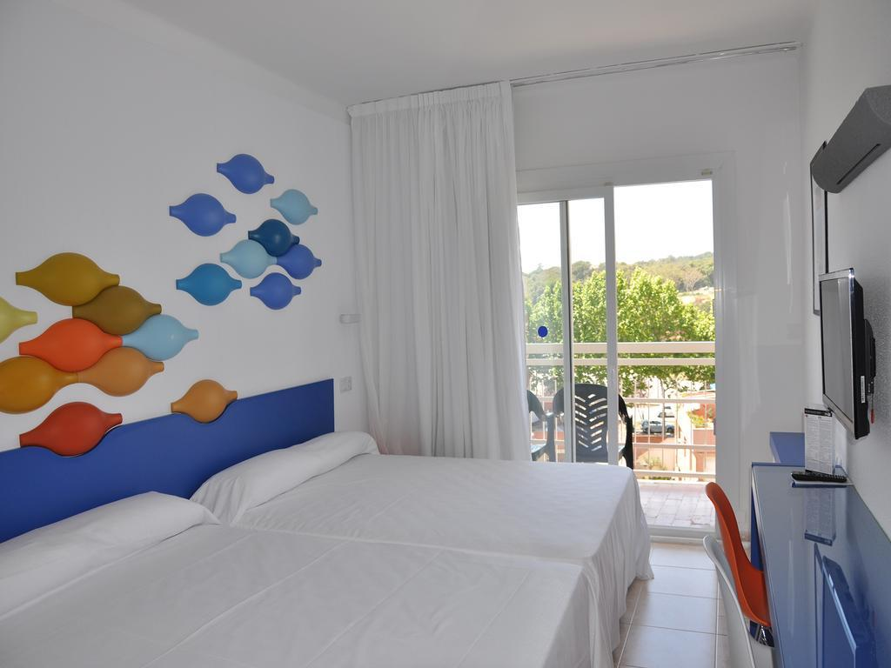

<head>
<link rel="stylesheet" href="https://cdnjs.cloudflare.com/ajax/libs/font-awesome/4.7.0/css/font-awesome.min.css">
</head>

  <h3>Evenia Olimpic Resort</h3>
  
This hotel is located in a quiet area of Lloret de Mar, 1 km from the beach. It offers 6 swimming pools, some of them with water slides.

The air-conditioned rooms at **Evenia Olympic Resort** feature flat-screen satellite TV, a safe and a private bathroom with a hairdryer and toiletries. Each one comes with a private balcony.

The hotel offers various buffet restaurants serving local and international food. There is also a poolside snack bar and a nightclub, as well as a varied entertainment programme for adults and children. The hotel also has an internet corner.

The Sport Club, accessible for an extra cost, includes a hot tub, a sauna, a heated indoor swimming pool and a Turkish bath. There are also squash courts and a fitness centre offering a range of classes.

You can walk to Lloret town centre in around 10 minutes from the Evenia Olympic Resort

    The all-inclusive package is including:
    Room with terrace
    Breackfast, lunch and dinner buffet
    Water, wine, beer, soft-drinks during lunsh or dinner
    Alcoholic drinks (standard brands), wine, beer, sangria and soft-drinks from 10.00h to 00.00h.(not
    included at the disco)
  

    
  

  

  
  

  

  
  

  

  
  

  

  

 

<section class="container">

<i class="fa fa-map-o" style="font-size:20px;color:orange;"></i> 
<b>Location: Lloret de Mar</b>

<i class="fa fa-h-square" style="font-size:20px;color:orange;"></i> 
<b>Category: 4 stars</b>

<i class="fa fa-cutlery" style="font-size:20px;color:orange;"></i> 
<b>Restaurants: 1 restaurant, 1 bar, 1 pool bar, and disco</b>

<i class="fa fa-wifi" style="font-size:20px;color:orange;"></i> 
<b>Free Wifi: available in rooms and common areas</b>

<i class="fa fa-coffee" style="font-size:20px;color:orange;"></i> 
<b>Meeting rooms: Evenia Congress Center from 20 to 800 pax</b>

<i class="fa fa-wheelchair" style="font-size:20px;color:orange;"></i> 
<b>Handicapped facilities: Yes</b>

<i class="fa fa-shower" style="font-size:20px;color:orange;"></i> 
<b>Outdoor swimmingpool: Yes</b>

<i class="fa fa-users" style="font-size:20px;color:orange;"></i> 
<b>Hotel Nr.of rooms: 352 rooms

<i class="fa fa-clock-o" style="font-size:20px;color:orange;"></i> 
<b>Check in/out: 1pm / check out 10h

</section>

  

