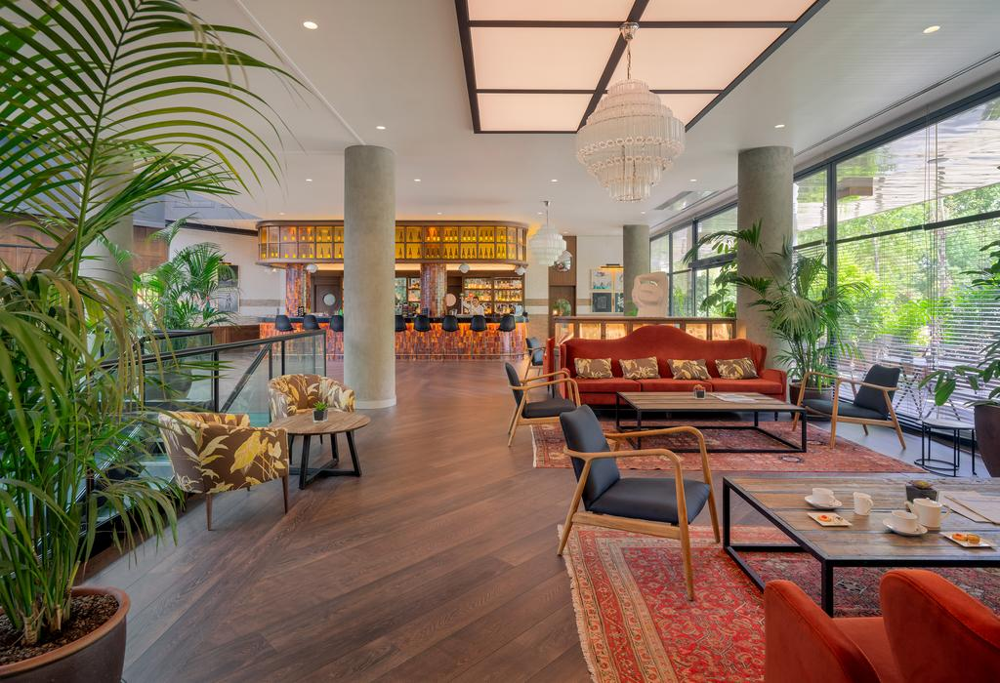
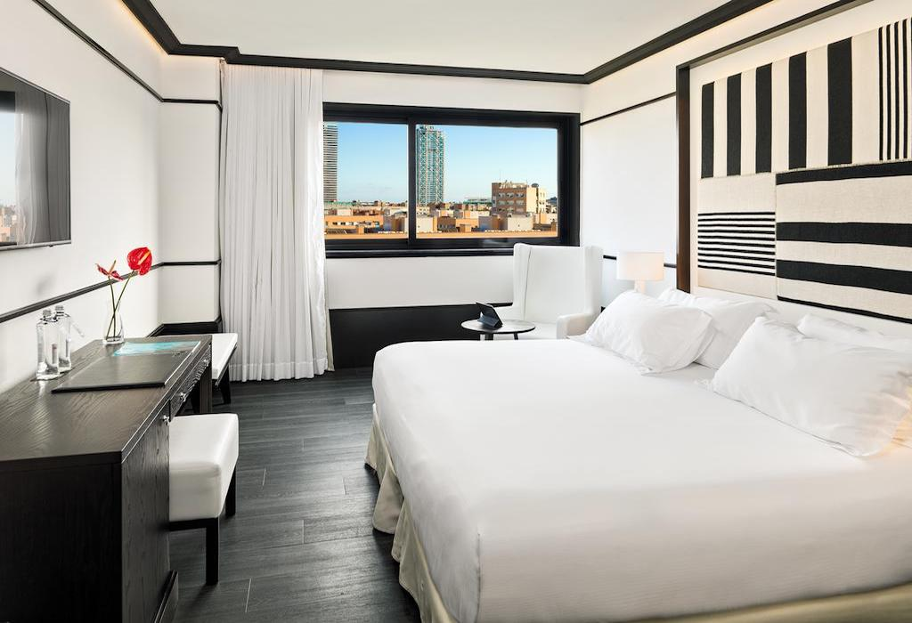
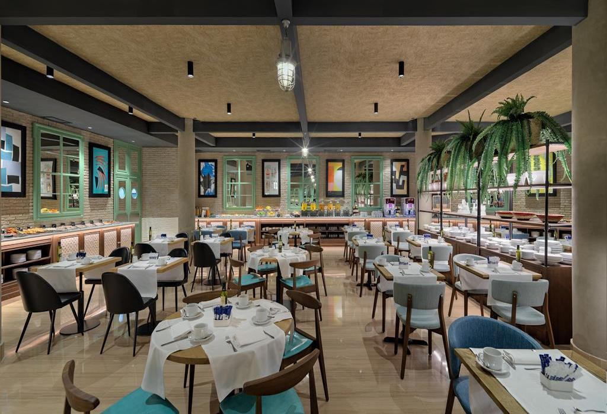

<head>
<link rel="stylesheet" href="https://cdnjs.cloudflare.com/ajax/libs/font-awesome/4.7.0/css/font-awesome.min.css">
</head>

  <h3>Hotel H10 Marina</h3>
  
**H10 Marina Hotel Barcelona** is 10 minutes’ walk from Barcelona’s **Olympic Port**. It offers a gym, spa and free Wi-Fi. The **rooftop pool** and sun terrace offer fantastic city and sea views.

The bright, air-conditioned rooms at the **Hotel H10 Marina Barcelona** feature parquet floors and satellite TV.

The hotel’s Dionissios restaurant serves à la carte and tapas meals, and room service is available. Bar La Llum offers an extensive wine list.

  

    
  

  

  
  

  

  
  

  

  
  

  

  

 

<section class="container">

<i class="fa fa-map-o" style="font-size:20px;color:orange;"></i> 
<b>Location: Olympic Port</b>

<i class="fa fa-h-square" style="font-size:20px;color:orange;"></i> 
<b>Category: 4 stars</b>

<i class="fa fa-cutlery" style="font-size:20px;color:orange;"></i> 
<b>Restaurants: 1 Restaurants and 2 bars</b>

<i class="fa fa-wifi" style="font-size:20px;color:orange;"></i> 
<b>Free Wifi: available in rooms and common areas</b>

<i class="fa fa-coffee" style="font-size:20px;color:orange;"></i> 
<b>Meeting rooms: 4 rooms up to max 200</b>

<i class="fa fa-wheelchair" style="font-size:20px;color:orange;"></i> 
<b>Handicapped facilities: Yes</b>

<i class="fa fa-shower" style="font-size:20px;color:orange;"></i> 
<b>Outdoor swimmingpool: Yes</b>

<i class="fa fa-users" style="font-size:20px;color:orange;"></i> 
<b>Hotel Nr.of rooms: 235 rooms

<i class="fa fa-clock-o" style="font-size:20px;color:orange;"></i> 
<b>Check in/out: 2pm / check out by 12.00h

</section>

  

