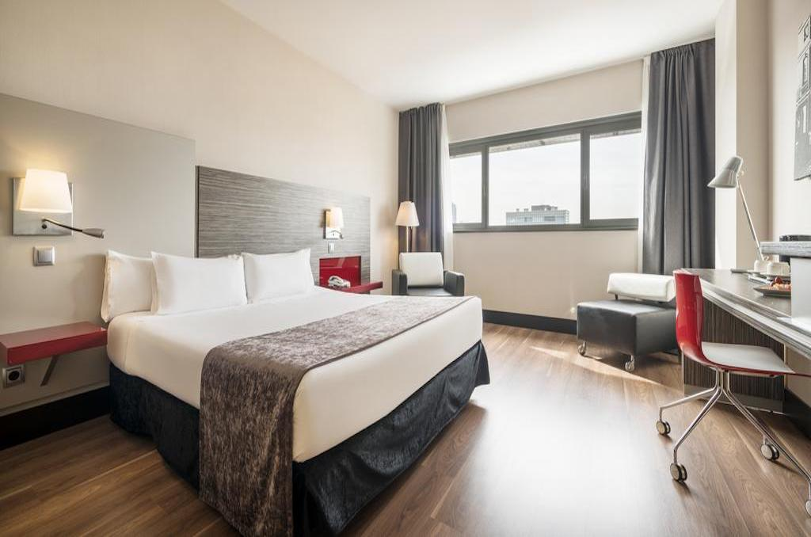
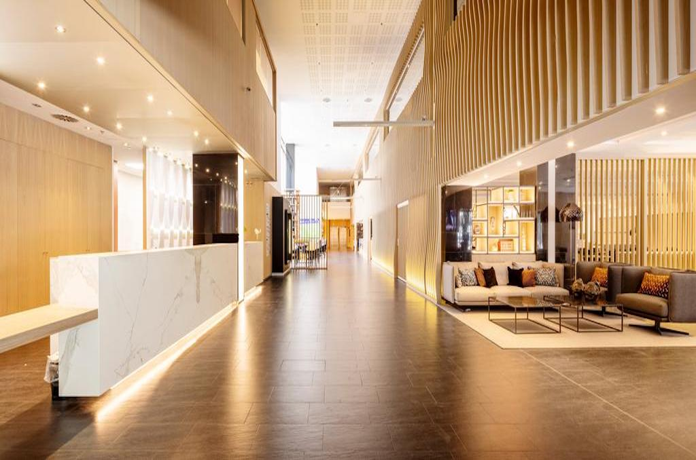
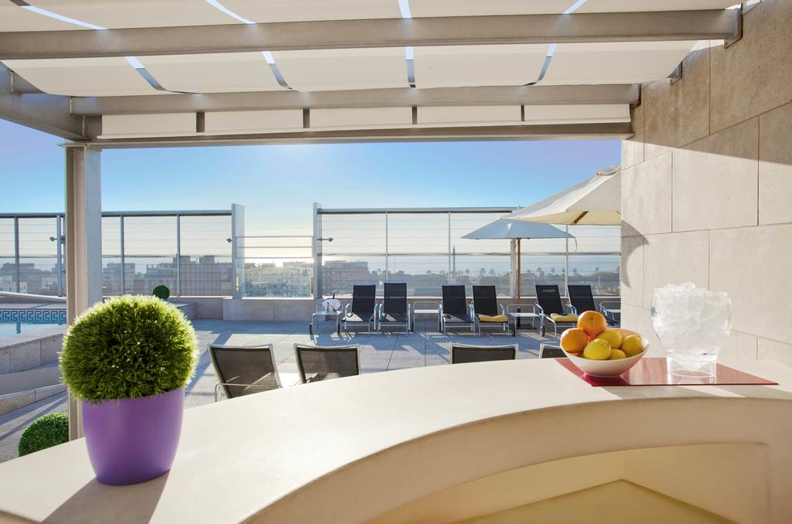

<head>
<link rel="stylesheet" href="https://cdnjs.cloudflare.com/ajax/libs/font-awesome/4.7.0/css/font-awesome.min.css">
</head>

  <h3>Ilunion Barcelona</h3>
  
Located 10 minutes’ walk from **Bogatell Beach** in the 22@ district, the modern **Ilunion Barcelona** features a rooftop swimming pool, sun terrace, and a gym with stunning views of the city and the sea. The CCIB Conference Centre is 2 km away. Free WiFi is available.

All stylish rooms at **Ilunion Barcelona** feature modern décor and wooden floors. This hotel is officially adapted for guests with reduced mobility, accessible rooms are available on request, also for people with auditory and visual impairment.

**Ilunion Barcelona's restaurant** offers a buffet breakfast, as well as an a-la-carté or set menu. There is also a snack bar. 

There is a wide range of shops, restaurants and bars in the Poblenou and Bogatell Beach areas, just a few meters from the hotel. Diagonal Mar Shopping Centre is 8 minutes' drive away.

Other facilities at Ilunion Barcelona include a free internet corner 

  

    
  

  

  
  

  

  
  

  

  
  

  

  

 

<section class="container">

<i class="fa fa-map-o" style="font-size:20px;color:orange;"></i> 
<b>Location: Sagrada Familia</b>

<i class="fa fa-h-square" style="font-size:20px;color:orange;"></i> 
<b>Category: 4 stars</b>

<i class="fa fa-cutlery" style="font-size:20px;color:orange;"></i> 
<b>Restaurants: 1 snack bar</b>

<i class="fa fa-wifi" style="font-size:20px;color:orange;"></i> 
<b>Free Wifi: available in rooms and common areas</b>

<i class="fa fa-coffee" style="font-size:20px;color:orange;"></i> 
<b>Meeting rooms: No</b>

<i class="fa fa-wheelchair" style="font-size:20px;color:orange;"></i> 
<b>Handicapped facilities: Yes</b>

<i class="fa fa-shower" style="font-size:20px;color:orange;"></i> 
<b>Outdoor swimmingpool: Yes</b>

<i class="fa fa-users" style="font-size:20px;color:orange;"></i> 
<b>Hotel Nr.of rooms: 215 rooms

<i class="fa fa-clock-o" style="font-size:20px;color:orange;"></i> 
<b>Check in/out: 2pm / check out by 12.00h

</section>

  

