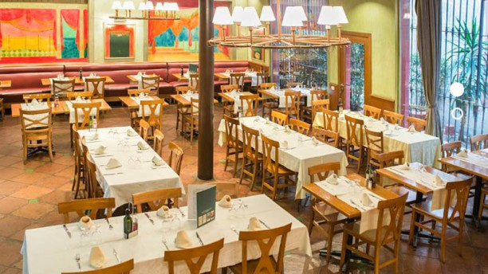
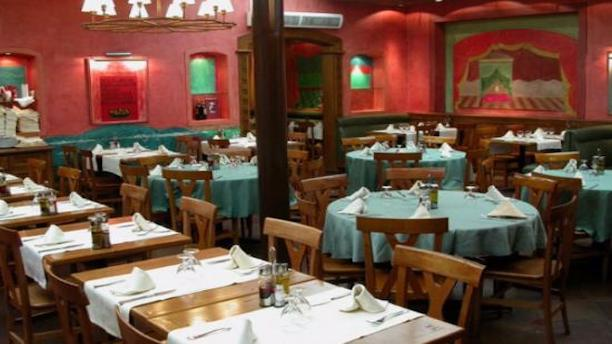

<head>
<link rel="stylesheet" href="https://cdnjs.cloudflare.com/ajax/libs/font-awesome/4.7.0/css/font-awesome.min.css">
</head>

  <h3>Restaurant Glop</h3>
  
This simple restaurant with a **rustic and informal atmosphere** located in the busy district of Gracia is already a legendary for dinner as a group. It has three private rooms with large capacity.

El Glop give us a proper, **traditional, lifelong Catalan cuisine**. They specialize in grilled meats, and the set menu includes also sausages and cheese, bread and tomato, spring onions, etc. If you want to try a little of everything, the Glop The grilled meat is the most successful.

  

    
  

  

  
  

  

  
  

  

 

<section class="container">

<i class="fa fa-map-o" style="font-size:20px;color:orange;"></i> 
<b>Location: City centre</b>
 

<i class="fa fa-cutlery" style="font-size:20px;color:orange;"></i> 
<b>Dining room capacities: 80 pax</b>
 

<i class="fa fa-eur" style="font-size:20px;color:orange;"></i> 
<b>Price Level: average-low</b>
 

<i class="fa fa-apple" style="font-size:20px;color:orange;"></i> 
<b>Vegetarian Options/Special diets: Available</b>
 

<i class="fa fa-handshake-o" style="font-size:20px;color:orange;"></i> 
<b>Style: Catalan cuisine</b>

<i class="fa fa-wheelchair" style="font-size:20px;color:orange;"></i> 
<b>Handicapped access: Yes
 

</section>

  

