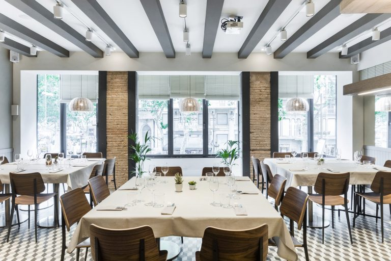
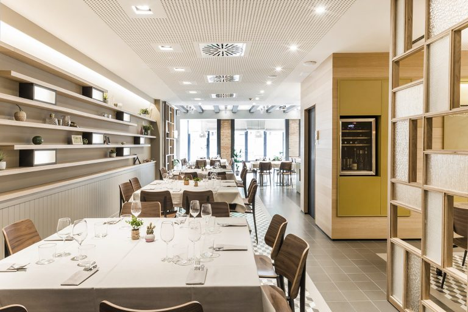

<head>
<link rel="stylesheet" href="https://cdnjs.cloudflare.com/ajax/libs/font-awesome/4.7.0/css/font-awesome.min.css">
</head>

  <h3>Raco de Nuria</h3>
  
**The Restaurant Racó del Nuria** is a direct **balcony to Las Ramblas** located on the first floor of a building in the center of the city, with Plaza Catalunya and La Rambla right beside. Below, there’s the world, the lights, the hustle and bustle of everyday life in Barcelona. Above, there’s the pleasure of the flavors, the smells, the colors, the ingredients and the tranquility.

In this space we propose a **Mediterranean cuisine** with touches of creativity in our tapas and with traditional rice dishes and paellas. We also have a carefully selected wine list to find a good pairing with their dishes. The culture and flavors are more appreciated when you feel at home and we invite you to live that experience in a flat that looks like a typical Catalan home from the Eixample Barcelonés.

  

    
  

  

  
  

  

  
  

  

  
  

  

 

<section class="container">

<i class="fa fa-map-o" style="font-size:20px;color:orange;"></i> 
<b>Location: City centre</b>
 

<i class="fa fa-cutlery" style="font-size:20px;color:orange;"></i> 
<b>Dining room capacities: restaurant 56pax interior 30pax</b>
 

<i class="fa fa-eur" style="font-size:20px;color:orange;"></i> 
<b>Price Level: average-low</b>
 

<i class="fa fa-apple" style="font-size:20px;color:orange;"></i> 
<b>Vegetarian Options/Special diets: Available</b>
 

<i class="fa fa-handshake-o" style="font-size:20px;color:orange;"></i> 
<b>Style: Mediterranean cuisine</b>

<i class="fa fa-wheelchair" style="font-size:20px;color:orange;"></i> 
<b>Handicapped access: No
 

</section>

  

